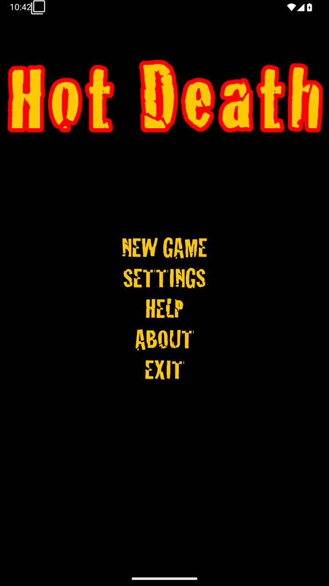
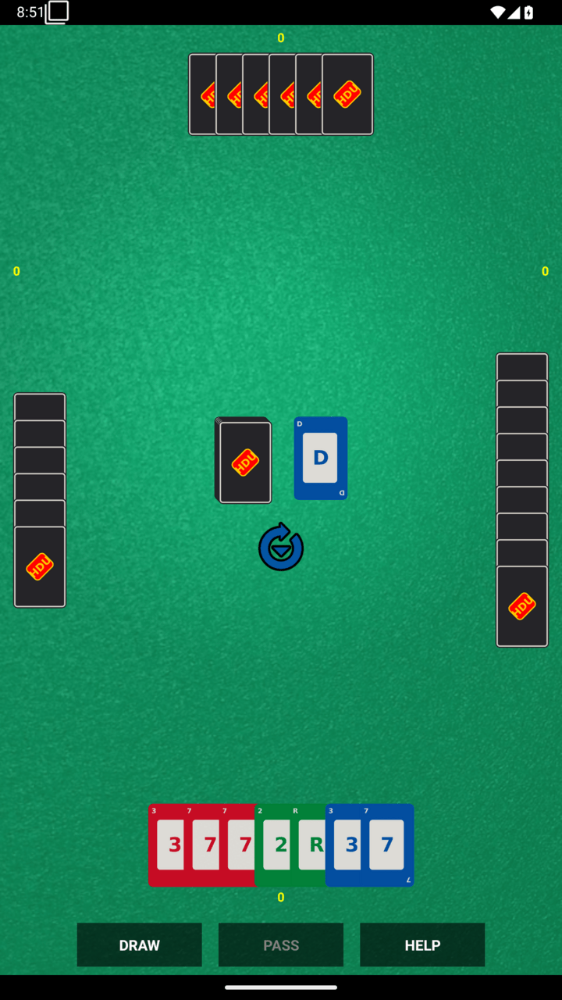
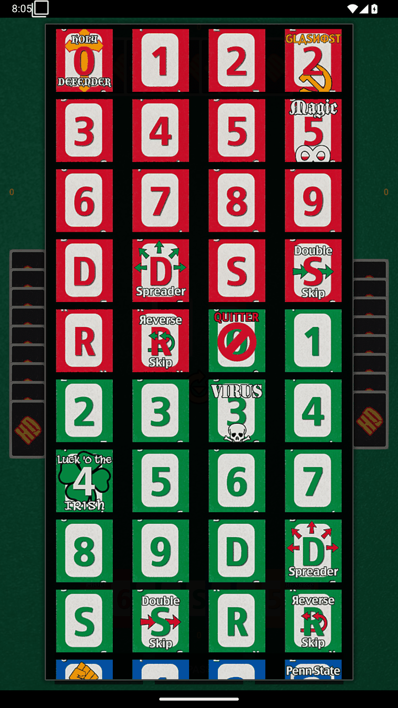
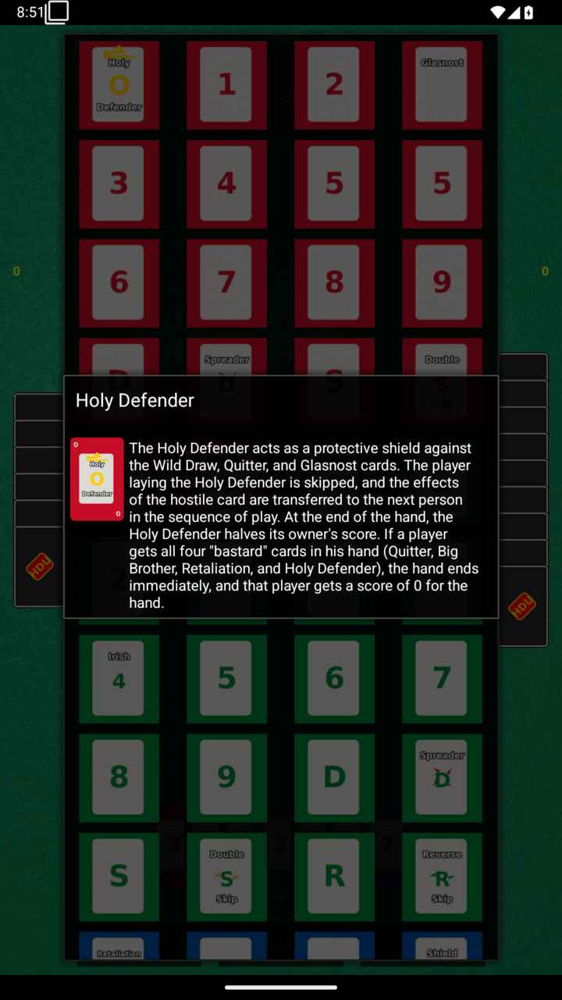

# Hot Death Uno

**An Android implementation of the Hot Death variant of the card game UNO.**

Hot Death UNO is a UNO add-on/variant that layers House Rules and 27 (or more,
depending on the variant) extra cards on top of standard UNO. The extra cards let
you remove players from the game, draw up to 69 cards at once, force an opponent to
lay their whole hand face up, and more. Fan favorites include Mystery Draw, the
Harvester of Sorrows, and Mutual Assured Destruction.

The app is a single-player, human-vs-AI implementation: you play the **South** seat
against three computer opponents at the North, East, and West seats. There is no
networked play.

| | |
|---|---|
| Package | `com.smccloud.hotdeath` |
| Current version | 1.4.18 (`versionCode` 1004018) |
| Platform | Android, `minSdk` 34 (Android 14) / `targetSdk` 36 (Android 16) |
| Language | Kotlin, on JDK 17 (the app became fully Kotlin at 1.4.5 and the test suite at 1.4.7; no Java source anywhere; no third-party runtime dependencies) |
| Build | Gradle 9.5.0 + Android Gradle Plugin 8.11.1 |
| License | MIT — see [License](#license) |

---

## Table of contents

- [Screenshots](#screenshots)
- [Playing the game](#playing-the-game)
- [The card set](#the-card-set)
- [Scoring](#scoring)
- [Settings](#settings)
- [Cheat codes](#cheat-codes)
- [Building](#building)
- [Project layout](#project-layout)
- [Architecture](#architecture)
- [Development notes](#development-notes)
- [License](#license)
- [Credits and history](#credits-and-history)

---

## Screenshots

| | |
|---|---|
|  |  |
| **Main** — New Game, Settings, Help, About, Exit | **In play** — your hand along the bottom, the opponents' hidden hands around the table, and the turn arrow on the discard pile |
|  |  |
| **Card catalog** — every card in the deck, from *Card Info* on the options menu | **Card rules** — tap any card in the catalog for its full rules text |

These are not mock-ups or hand-assembled composites. They are screenshots of the
release APK, taken on an emulator by the `Screenshots` stage in the `Jenkinsfile`,
and they are reproducible: the stage boots an API 35 emulator, drives the app
through `uiautomator` by resource ID rather than by tapping fixed coordinates, and
archives the results alongside the APK. It is off by default because it costs a
whole extra emulator boot and nothing in the build depends on it.

    # Linux and macOS; add -n to queue and walk away instead of watching
    ./jenkins.sh build --no-tests --screenshots

    # Windows
    ./jenkins.ps1 build -NoTests -Screenshots

Both clients read their credentials from `./jenkins-creds` (or the environment),
and neither sources that file: `jenkins.sh` parses it, because a credentials file
that gets executed rather than read is a code-execution hazard the moment it is
ever copied or synced somewhere. With neither `--screenshots` nor
`--no-screenshots`, the parameter is not sent at all and the job's own default
applies.

The PNGs come out of the build's artifacts, in `com.smccloud.hotdeath/app/build/
screenshots/`. This set was scaled and quantised with `sharp`; anything that does
the same two things will do.

The committed images are the same PNGs at 720×1280 and quantised to 256 colours,
which takes them from 6.0 MB to 1.2 MB with no visible difference — this is flat
pixel art over a dithered felt background, so the palette costs nothing and the
resize does most of the work. The originals are 1080×1920 in the build artifacts,
even though the stage asks for a 1080×2160 display: the device clamps the override
to 1920, which is why the committed images are 9:16 and why the stage's comment
should not be taken as describing what comes out.

The current set is build #128 of version 1.4.16, and this time it was not just for
currency. The card art was genuinely out of date: the SVG card faces and back have
been regenerated and rasterised over `res/drawable-*` (e464a7c through d405f31),
and the previous set is a good record of the defects that fixed. On the old shot
the back of every card clips the *Hot Death* logo down to an orange sliver along
the top, and a face-up card draws its label across the big rank — "GLASNOST"
through the 2, "Reverse" through the R — with the digits clipped by the card
edge. Both are gone: a back carries the whole logo, and a face-up card is a rank
with a small index in each corner, labelled or not.

The main menu is otherwise identical apart from the clock, and Continue is
*absent* from it: the emulator is wiped, so there is no saved game and the button
is hidden. The hand and the table differ from run to run, since the deal is
random.

---

## Playing the game

The launch screen (**Main**) offers New Game, Continue, Settings, Help, About, and
Exit. Continue is only shown when a saved game exists.

1. A random player is picked to deal the first hand; after that, the winner of the
   previous hand deals.
2. The dealer chooses how many cards to deal, between **5 and 15**.
3. Tap a card in your hand to play it. The badge in the lower-right corner of a hand
   shows how many cards it holds. A hand that overflows the table scrolls — drag it
   with a finger or the mouse button, or turn a mouse wheel over it. A trackpad
   works too: the table accumulates the travel, so a short swipe moves a card or two
   and a long one moves as far as you take it.
4. **DRAW** and **PASS** are also available from the options menu, as is **HELP**.
5. Tap and hold any card to see its rules text in-game, or use the menu's *Card Info*
   to browse the full card catalog for the deck currently in play.
6. A round ends when a player empties their hand. Hands are then revealed, scores are
   tallied, and the game ends once a player reaches the target score.

Play is to **1000** points, lowest score wins. If the human player is ejected, a
**FAST FORWARD** button appears so you can skip the remaining turns.

### Turn flow

Every turn runs through `Game.advanceRound()`:

```
prompt user (human seat only)
  -> Player.startTurn()          // sets wantsToDraw / wantsToPlayCard / wantsToPass
  -> play a card?
       -> discard, set color, choose color if wild
       -> handleSpecialCards()   // creates a Penalty if the card is hostile
       -> checkForDefender()     // offer the victim a chance to counter
       -> advance turn
  -> draw / pass?
  -> no valid cards?  -> assessPenalty() or force a draw
  -> winner check     -> empty hand, or all four "bastard" cards
```

Human input is a cross-thread handshake: `HumanPlayer.startTurn()` spin-waits on the
game thread until the UI thread calls `turnDecisionPass()`, `turnDecisionDrawCard()`,
or `turnDecisionPlayCard(Card)`.

---

## The card set

### Standard cards

| Card | Count (1 deck) | Points |
|---|---|---|
| `0` | replaced by a bastard card in every color | — |
| `1`–`9` | 2 per color | face value |
| Draw Two | 1 per color | 20 |
| Skip | 1 per color | 20 |
| Reverse | 1 per color | 20 |
| Draw Two Spreader | 1 per color | 60 |
| Double Skip | 1 per color | 40 |
| Reverse Skip | 1 per color | 40 |
| Wild Draw Four | 4 | 50 |

A one-deck game is **108 cards**; enabling *Two decks* builds **216**.

### Wild variants

| Card | Effect | Points |
|---|---|---|
| **Hot Death Draw Four** | Wild Draw **8**, stackable | 100 |
| **Delayed Blast Draw Four** | Skips a player, then Wild Draw 4; stackable | 100 |
| **Harvester of Sorrows** | Wild Draw 4; stackable *onto*, nothing stacks onto it, cannot be defended | 0 |
| **Mystery Wild** | On a number: draw that many. On the 69: draw 69. On anything else: plain Wild | 10 x highest number in hand |

### Bastard cards

Exactly one copy of each, so no duplicates to memorize:

| Card | Color | Effect | Points |
|---|---|---|---|
| **Holy Defender** | Red 0 | Defends against Wild Draw / Quitter / Glasnost. Skips its owner and passes the penalty down the table | halves score |
| **Glasnost** | Red 2 | Forces a chosen player to lay their whole hand face up | 75 |
| **Magic 5** | Red 5 | Playable on *any* card; nullifies a Hot Death outright | -5 |
| **Quitter** | Green 0 | Removes the next player from the hand entirely | 100 |
| **AIDS / Virus** | Green 3 | Shares the incoming penalty with whoever dealt it | 3, +10 cumulative |
| **Luck of the Irish** | Green 4 | Draws one card fewer than required — passively, without being played | 75 |
| **Fuck You / Retaliation** | Blue 0 | Sends a Wild Draw / Quitter / Glasnost back at the thrower and reverses direction | doubles score |
| **Blue Shield** | Blue 2 | Immune to Spreaders | value of highest card in hand |
| **Shitter / Big Brother** | Yellow 0 | Playable only on Holy Defender, Magic 5, or as your last card; forces the *highest* table score | adopts max |
| **Mutual Assured Destruction** | Yellow 1 | Ejects a chosen player — and you | 100 |
| **69** | Yellow | Playable on any 6 or 9 regardless of color; locks your hand total to 69 | locks at 69 |

The three profanity-named cards (**Fuck You**, **AIDS**, **Shitter**) are displayed
with family-friendly names (**Retaliation**, **Virus**, **Big Brother**) by default.
See [Cheat codes](#cheat-codes) to restore the originals.

**The bastard set**: holding all four of Holy Defender, Quitter, Fuck You, and Shitter
ends the hand immediately with a score of **0** for that player.

### Penalty resolution

`Penalty` is a flat state record, not a hierarchy — one active penalty at a time, with
an optional secondary victim:

| Type | Constant |
|---|---|
| none | `PENTYPE_NONE` |
| draw N cards | `PENTYPE_CARD` |
| remove player from the hand | `PENTYPE_EJECT` |
| reveal the victim's hand | `PENTYPE_FACEUP` |

Splitting a penalty (AIDS) gives each victim `(n + 1) / 2` cards. Luck of the Irish
decrements the count by one.

**Stacking** is permitted under Hot Death rules, and only there. A Wild Draw answers
another Wild Draw, and a **Draw 2 answers another Draw 2** — the same card is the only
answer either way. Mystery Draw and the Harvester of Sorrows are excluded, as are
Spreader and Skip. Whether a victim gets the turn that lets them answer at all is
`Game.checkForDefender`, which counts the cards that can answer *that* penalty: a Draw
Four's stack, or a Draw 2 for a Draw 2.

**The victim is always stepped past**, under both rule sets. They draw and lose their
turn, which is what plain UNO does; `standardrules` used to be the one setting in which
they drew and then played.

**Retaliation, AIDS and the Holy Defender do not answer a Draw 2.** They answer a Wild
Draw, a Quitter or a Glasnost, which is what the card set table above says. A Draw 2
in hand is therefore the only thing that answers a Draw 2.

**A penalty card that opens the round is eaten by the dealer.** `postDealHands` turns
the top card over, and if that card is a Draw 2, a Quitter, a Glasnost or a MAD, the
dealer is its victim — they draw the two, lay their hand face up, remove the next
player, or pick a victim and be ejected with them. A wild can never open a round (the
draw skips them) so there is no Wild Draw Four to absorb, and Skip and Reverse are
excluded because they have no victim and the dealer's turn is not in the rotation.

---

## Scoring

Scoring lives in `Hand.calculateValue()`, an ordered eleven-step pass:

1. Bastard set check (delegates to `Game`).
2. **Full Monty** — Quitter + Fuck You forces the hand to 1000; each card is valued
   at 500 so the AI dumps them. Shitter alone takes a pseudo-value of 150.
3. Sum the fixed-value cards, tracking the highest card and highest number. Ending a
   hand with AIDS adds a cumulative +10 per hand you go on to lose.
4. Mystery Wild = `10 x highest number in hand` (or 10 if you hold no numbers).
5. Blue Shield = value of the highest card in your hand.
6. **69** locks the hand total to exactly 69.
7. Magic 5 subtracts 5.
8. Fuck You doubles.
9. Holy Defender halves, rounding up: `(total + 1) / 2`.
10. Shitter adopts the highest hand total at the table.
11. Virus penalties accumulate in `Game.calculateScore()`.

The per-card `setCurrentValue(...)` result of every step is also the AI's heuristic
input, which is why this one method serves both scoring and card selection.

> When adding a new card type, `Hand.CheckCard()`, `Hand.CheckForDefender()`, and
> `Game.HandleSpecialCards()` must be edited together — the scoring pass was overhauled
> in v1.0.1 and the comment in `Hand.calculateValue()` says so.

---

## Settings

Defined in `res/xml/preferences.xml` and read through `GameOptions`.

| Setting | Key | Default | Values |
|---|---|---|---|
| Game speed | `game_speed` | `1` (Fast) | 0 Very fast … 4 Very slow |
| Novice mode | `novice_mode` | `false` | Pause for a tap instead of a timed delay, so play can be followed at your own pace |
| Two decks | `two_decks` | `false` | 108-card or 216-card deck |
| Computer 4th | `computer_4th` | `false` | Let the AI take the South seat at the *North* player's difficulty (for testing — it leaves no human in the game) |
| Face up | `face_up` | `false` | Reveal all cards — useful for learning |
| Cheat level | `cheat_level` | `0` (Honest) | 0 Honest, 1 Rascal, 2 Scoundrel, 3 Dirtbag |
| Cheat code(s) | `cheat_code` | `""` | Comma-separated; see below |
| Skill (per computer seat) | `p{1,2,3}_skill` | `1` | 0 Weak, 1 Strong, 2 Expert — West, North, East; there is no fourth pair, and `computer_4th` uses North's |
| Aggression (per computer seat) | `p{1,2,3}_aggression` | `0` | -6 Pushover, -3 Nice guy, 0 Normal, 3 Jerk, 6 Sadist — same three seats |
| Saved game | `gamestate` | `""` | Written by `GameActivity.onPause()`, not user-editable |

### AI behavior

*Skill* controls how much of the heuristic the AI is allowed to use:

The AI is rule-based throughout. Every decision is a score, and it never plays a
card that `Game.checkCard` says is illegal, so the interesting question is never
whether a play is legal but which legal play it picks.

- **Weak (0)** — scores candidates by `getCurrentValue()` only, so it unloads
  whichever legal card is worth the most points. That is why it throws a Draw Four
  early: `Hand.calculateValue` puts the card at 50, and 50 beats a 5.
- **Strong (1, 2)** — plays a defensive card immediately if one is legal; otherwise
  scores the rest and takes the best. Special-cases the M.A.D. card, the 69, and
  Mystery Wild (Mystery is thrown preferentially on high numbers, and at a 69 above
  everything else).
- **Expert (2)** — adds three things to that: a colour-balance score, the tie-break
  that goes with it, and a colour lead chosen against the table rather than against
  itself.

**Holding on to wilds.** A wild scores -60 at Strong and above — below the worst any
other card can reach, since the Magic 5 is -5 and the M.A.D. card can be -20 — and
above the -1000 that an unplayable hand scores, so a wild is played when the hand is
otherwise stuck and held otherwise. The one exception is an opponent on their last
card, where a wild is the only card in the deck that can change the colour at will.

**Colour balance, and the tie-break.** `computeColorBalance` measures how lopsided
the four suit counts are. Expert already scored a card by how much playing it would
improve that, and now uses it to *break a tie* as well: two cards of equal score are
decided by the play that leaves the hand most even. Which of two identical cards gets
played is therefore no longer the order of the hand array.

**Counting the table.** When a seat names a colour, Expert charges each colour for
what the opponents are likely to be holding, and a colour it holds nothing of is
never named. The deck is a known list of cards, so subtracting this seat's hand and
the face-up discard pile leaves the cards that are either in the draw pile or in
somebody's hand; the draw pile's share is discounted, which makes the estimate
tighten as the round runs and stay silent while the deck is still mostly unknown.
Each opponent contributes its chance of holding the colour, weighted by 4/(cards+1)
so that a player on their last card costs more than one with a full hand, and each
colour is scored as `cards held - pressure`.

Nothing in there reads another player's hand. The deck holds references to the same
`Card` objects the hands do, so counting them would be a sharper answer than a player
at the table could have.

*Aggression* biases victim selection toward the human's seat and gates the expert
color-balance heuristic — a Sadist (`+6`) will wait out a color imbalance until the
opponent is down to 2 cards.

*Cheat level* N deals N special cards straight into the human's hand at deal time.

### Game speed

`Game.getDelay()` returns the pause between computer moves in milliseconds:
`0` while fast-forwarding, `250` when the human seat is inactive, then `700` / `1200` /
`1700` / `2900` / `4000` for settings `0`–`4`.

---

## Cheat codes

Enter these comma-separated in **Settings → Cheat code(s)**. Some require a restart.
Matching is a plain `String.contains()` in `GameOptions`.

| Code | Effect |
|---|---|
| `originalhotdeath` | Turns off family-friendly mode, restoring the card names **Fuck You**, **AIDS**, and **Shitter** |
| `standardrules` | Switches to a plain UNO ruleset: fixed 7-card deal, no defensive plays, no card-penalty stacking at all, and the target score drops to 500 |

---

## Building

### Requirements

- JDK 17 or newer (required by Android Gradle Plugin 8.11.1)
- Android SDK Platform 36
- Gradle 9.5.0+ (or Android Studio Meerkat and newer)

### With Android Studio

Open the `com.smccloud.hotdeath` directory as a project. The Gradle sync pulls the
Android Gradle Plugin and builds from there.

### From the command line

```bash
cd com.smccloud.hotdeath
gradle assembleDebug
gradle assembleRelease
```

Outputs land in `com.smccloud.hotdeath/app/build/outputs/apk/`.

### Wrapper caveat

`gradlew` and `gradlew.bat` are committed, and
`gradle/wrapper/gradle-wrapper.properties` pins Gradle 9.5.0 — but
**`gradle-wrapper.jar` is still not in the repository**. `./gradlew` will fail until
you run `gradle wrapper` once to generate it, or let Android Studio regenerate it on
sync. There is also no `local.properties` — set `sdk.dir` to your Android SDK path, or
rely on `ANDROID_HOME`.

### Tests and CI

`app/src/test` holds the JVM and Robolectric suite (`gradle testDebugUnitTest`) and
`app/src/androidTest` the instrumented one (`gradle connectedAndroidTest`, which
needs a device or emulator). A tracked `Jenkinsfile` runs both: unit tests, lint,
`assembleDebug`, `verifyVersionCode`, `assembleRelease`, then
`connectedDebugAndroidTest` on a headless emulator at API 34, 35 and 36.

The suite runs on the JVM with Robolectric, which means **it can be run without an
emulator**. `GameTableLayoutTest` in particular needs nothing but a measure spec and
a layout call, and covers window shapes no emulator in the matrix has.
`GameTableInputTest` sends real `MotionEvent`s at a drawn table, which is how the
touch and wheel behaviour is covered at all — no emulator in the matrix has a mouse.

`verifyVersionCode` is the versioning gate described under
[Credits and history](#credits-and-history): it fails the build when
`app/build.gradle`'s `versionCode` is not strictly greater than the highest
published `v*` tag. It needs the tags present, so it is not wired into `check` —
a clone or a source-archive export has none, and failing `check` for that would be
worse than not checking. The Jenkinsfile's Checkout stage fails if the tags were
not fetched, because otherwise the task would pass silently.

The release APK is the published artifact, and since 1.2.0 it is **signed with the
project's release certificate** rather than the debug key. The key itself is not in
the repository: `app/build.gradle` reads `keystore.properties` when that file is
present and falls back to the debug key when it is not, so a fresh clone still
builds something installable. CI supplies the real material from Jenkins credentials
and the pipeline prints the signing certificate into the console log, so the key
that signed any given artifact can be checked rather than assumed. The published
releases are on the [GitHub releases page](https://github.com/smccloud/Hot-Death-Uno/releases).

One thing the pipeline still does not cover: `connectedAndroidTest` runs against the
debug APK, so the R8-minified release build is assembled, signed and archived but
never exercised on a device.

The `SCREENSHOTS` parameter is the one thing here that exists for the documentation
rather than the build. It is off by default and, when on, adds a stage that boots an
emulator and captures the four images under [Screenshots](#screenshots) from the
release APK. It is not part of the release gate: it is here so that the README
pictures can be regenerated by anyone, on demand, instead of being re-shot by hand
and drifting.

---

## Project layout

```
.
├── LICENSE                       MIT
├── README.md                     this file
└── com.smccloud.hotdeath/       the Gradle root
    ├── build.gradle              root buildscript; AGP 8.11.1
    ├── settings.gradle           include ':app'
    ├── gradle.properties         2 GB daemon heap
    ├── gradle/wrapper/           distributionUrl pinned to Gradle 9.5.0 (no JAR committed)
    ├── proguard.cfg              legacy ProGuard rules, superseded by app/proguard-rules.pro
    ├── default.properties        vestigial Ant-era stub
    ├── gradlew, gradlew.bat      wrapper scripts
    ├── CHANGELOG.txt             release notes, v0.9 through v1.0.5
    ├── README.md                 original project blurb
    ├── artwork/                  GIMP source for the store feature image
    └── app/
        ├── build.gradle          compileSdk 36, minSdk 34, versionCode 1004013
        ├── proguard-rules.pro    R8 rules (release is minified)
        └── src/
            ├── main/
            │   ├── AndroidManifest.xml
            │   ├── java/com/smccloud/hotdeath/    16 classes, ~8,300 lines (all Kotlin)
            │   └── res/
            │       ├── layout/       7 XML layouts + layout-land/
            │       ├── values/       strings.xml, arrays.xml, colors.xml
            │       ├── xml/          preferences.xml
            │       └── drawable-*/   692 PNGs, 8.3 MB across 5 density buckets
            ├── test/kotlin/com/smccloud/hotdeath/          142 tests, Robolectric
            └── androidTest/kotlin/com/smccloud/hotdeath/   9 tests, needs a device
```

Both test source sets are Kotlin and both live in a `kotlin/` directory rather
than `java/`. Nothing in `app/build.gradle` declares them: AGP and the Kotlin
plugin each register `src/<sourceSet>/kotlin` themselves, so moving the tests
there needed no build change. `src/test/resources/robolectric.properties` stays
where it is — resources are a separate source set from code.

### Artwork

The card art is drawn per-density, following the standard `ldpi:mdpi:hdpi:xhdpi`
`3:4:6:8` ratio, with the `xlarge-*` buckets using tablet-sized art instead:

| Bucket | Card height | Files |
|---|---|---|
| `drawable-mdpi` | 80 px | 144 |
| `drawable-hdpi` | 120 px | 144 |
| `drawable-xhdpi` | 160 px | 144 |
| `drawable-xlarge-mdpi` | 120 px | 144 |
| `drawable-xlarge-hdpi` | 160 px | 144 |
| `drawable-ldpi` | icons only | 2 |

The whole art set was run through `pngquant 128`, which cut the APK from 13 MB to
6 MB. Going to 64 colours was tried and looked too bad.

Card bitmaps are named `card_<color>_<value>[_<variant>].png`, and are resolved by
`GameTable.initCards()` from an 81-entry table of card IDs — this mapping is
hand-maintained and must be extended whenever a card is added.

---

## Architecture

Sixteen classes, ~8,300 lines, no third-party libraries — all Kotlin. The
Java-to-Kotlin migration finished at 1.4.5; the test suite followed at 1.4.7,
so there is no Java source left anywhere in the repository. There is no MVP/MVVM
layering; the game engine and the view are deliberately coupled.

```
Main ──> GameActivity ──> GameTable (View, custom Canvas drawing)
              │                   ▲
              ├──> GameOptions <───┘   setGameTable() / getString()
              │        │
              │        └──> Prefs (PreferenceActivity, SharedPreferences)
              └──> Game (extends Thread)  ──> Player / ComputerPlayer
                          │                      └──> Hand ──> Card
                          ├──> CardDeck ──> Card
                          ├──> CardPile  (draw + discard)
                          └──> Penalty
```

### Class reference

| Class | Lines | Role |
|---|---|---|
| **`Game`** | 2,062 | The rules engine *and* the game thread. Owns the deck, both piles, the four players, the active penalty, and the turn loop. Reaches the UI only through `runOnUiThread` and `GameTable.getString()`. |
| **`GameTable`** | 2,411 | The entire board, drawn by hand on a `Canvas` — no layout XML. Handles portrait/landscape/near-square geometry and window-proportional card sizing, per-seat hand placement, drag and wheel scrolling, pile rendering, direction and color indicators, scores, aggressor/victim emoticons, card-count badges, hit testing, long-press card help, and the color/victim/deal dialogs. |
| **`CardDeck`** | 796 | Card factory and registry. `reset(standardRules, oneDeck)` builds every card by enumeration, then `shuffle()` permutes a parallel `m_oCards` array so the canonical `m_cards` array stays in ID order for the UI. |
| **`ComputerPlayer`** | 517 | The AI. See [AI behavior](#ai-behavior). |
| **`Hand`** | 472 | A player's cards plus the eleven-step scoring pass in `calculateValue()`. |
| **`Player`** | 293 | Base class for a seat: score, hand, skill, aggression, and the decision flags the turn loop reads back after `startTurn()`. |
| **`Penalty`** | 216 | The active penalty record — type, card count, originating card, generating player, victim, secondary victim. |
| **`HumanPlayer`** | 199 | Bridges the game thread to the UI thread via spin-wait handshakes. |
| **`Prefs`** | 173 | The settings screen, plus static typed accessors used by `GameOptions`. |
| **`Main`** | 141 | Title screen. |
| **`Card`** | 343 | One card: color, value, ID, face-up flag, deck index, and the mutable scoring state (`currentValue`, `pointValue`, `pointMultiplier`, `cumulativePenalty`, `highestCardMatch`). Owns the whole card-ID constant namespace. Also holds a back-pointer to its owning `Hand`. |
| **`CardPile`** | 92 | Fixed-capacity LIFO stack, used for *both* the draw and discard piles. |
| **`GameOptions`** | 87 | Thin adapter over `Prefs` that caches a `GameActivity` reference, so `Game` and `Player` never touch a `Context` directly. Also resolves the two cheat codes. |
| **`CardImageAdapter`** | 91 | `BaseAdapter` for the card-catalog `GridView`, filtered to the cards actually present in the current deck. |
| **`TapDismissableDialog`** | 39 | Dialog that dismisses on tap, provided the finger moved less than 7 px on both axes. |

### Threading model

Exactly two threads: the Android UI thread and `Game`, which `extends Thread`.

```
Game.run()
  startGame()  or  resume from snapshot
  while (!m_gameOver) {
      runRound()          // snapshots state every turn
      waitForNextRound()
      startRound()
  }
  shutdown()
```

- **Pause/resume** uses a `m_pauseLock` monitor, a `m_paused` flag, and
  `waitUntilUnpaused()`. `toJSON()` synchronizes on the same lock so a snapshot can
  never tear against a pause.
- **Human interaction is a 100 ms spin-wait**, not a lock — `HumanPlayer.startTurn()`,
  `getNumCardsToDeal()`, `chooseColor()`, `chooseVictim()`, and
  `Game.waitForNextRound()` all busy-loop until a flag is flipped by the UI thread.
- **Shutdown is two-phase.** The first `shutdown()` sets `m_stopping`, which is polled
  after every blocking call. The second, from `GameActivity.onDestroy()`, releases the
  references to `GameTable`, `GameOptions`, `GameActivity`, and the players.
- **The game model itself is unsynchronized.** Only the game thread mutates it; the UI
  thread reads it via redraw requests. The startup handshake is a bit unusual:
  `GameTable.onSizeChanged()` is what actually calls `Game.start()`.

### Save / restore

State is serialized to a `JSONObject` and stored as a string in the `gamestate`
preference.

- **Save** — `GameActivity.onPause()` pauses the game, takes a snapshot, and commits it.
  `getSnapshot()` returns `""` if the game is over, which is also how *Continue* knows
  to hide itself.
- **Cadence** — a snapshot is taken at the top of every turn, plus at the end of a
  round, so a restore always resumes at a turn boundary.
- **Shape** —
  ```json
  {
    "state":       { "dealer": 1, "currPlayer": 2, "currColor": 3,
                     "direction": 1, "cardsPlayed": 7,
                     "roundComplete": false, "currCard": 42 },
    "deck":        [ /* every Card object, fully serialized */ ],
    "drawPile":    [ /* deck indices */ ],
    "discardPile": [ /* deck indices */ ],
    "penalty":     { /* ... */ },
    "players":     [ /* 4x: active, scores, virus penalties, hand indices */ ]
  }
  ```
  Only the `deck` carries card *data*; hands and piles serialize as deck indices.
- **Restore** — `Game(JSONObject, GameActivity, GameOptions)` rebuilds the deck first
  so index lookups resolve, then the piles, then the state, then the players, then the
  penalty.
- **Class reconstruction is preference-driven, not serialized.** Slot 0 (South) becomes
  a `HumanPlayer` or a `ComputerPlayer` based on the *current* `computer_4th` setting,
  so toggling it between plays changes who the South seat is on resume.

---

## Development notes

### Android 16 (API 36) retarget

`minSdk` was raised from 29 to 34 and `targetSdk`/`compileSdk` from 33 to 36. Because
AGP 7.3.0 tops out at `compileSdk` 33, the toolchain moved to **AGP 8.11.1 / Gradle
8.13 / Java 17** at the same time. That upgrade is not cosmetic — it is what makes API
36 possible at all.

Three behavioral changes came with the retarget:

- **Edge-to-edge is now mandatory.** Since `targetSdk` 35 the framework no longer lets
  an app reserve room for the system bars, and there is no opt-out. Each activity now
  installs a `WindowInsets` listener on `android.R.id.content` and pads it by the
  system-bar and display-cutout insets (`applyEdgeToEdgeInsets()` in `Main`,
  `GameActivity`, and `Prefs`). Because `GameTable` recomputes its entire layout from
  its view size in `onSizeChanged`, padding the content frame is enough — the board,
  the hands, and the options menu all re-flow. This uses the platform `WindowInsets`
  API, available from API 30, so the project still has **zero third-party
  dependencies**; the obvious alternative, `androidx.core`'s `WindowInsetsCompat`,
  would have forced AndroidX on the project.
- **Predictive back needed no migration.** Nothing in the app overrides
  `onBackPressed()`, so the default behavior is already correct under the API 36
  back-dispatch model.
- **Rotation no longer recreates the activity.** `configChanges` for
  `orientation|screenSize|screenLayout|smallestScreenSize|keyboardHidden|density` is now
  declared on all three activities. This makes the pre-existing
  `onConfigurationChanged()` overrides actually fire — they were dead before, because
  without the manifest attribute Android recreates the activity instead. It also avoids
  losing an in-progress game on rotation, which happened because the game is persisted
  to preferences and the `STARTUP_MODE` intent extra does not survive recreation.

> **Cosmetic side effect:** `Prefs` was given `android:theme="@android:style/Theme.NoTitleBar"`
> to match the other two activities, which means the settings screen no longer draws
> its own title bar. Content padding alone cannot inset a framework title bar, and the
> old title ("Hot Death settings") is the activity's own label. Revert that one
> attribute if you would rather keep the title bar and accept the overlap.

### Foldables and the table layout

The table is laid out entirely from the window: `GameTable.onSizeChanged` recomputes
all four seats, both piles, the direction colour, the four player indicators, the card
badges, the score text, the emoticons, the toast anchor and the winning banner out of
`w` and `h`. Two things about that were wrong until 1.4.17, both recorded in
[#13](https://github.com/smccloud/Hot-Death-Uno/issues/13).

**The cards were not part of it.** `m_cardWidth` and `m_cardHeight` are the card
bitmap's dimensions, taken from the resource density — 52×80 at mdpi, 77×120 at hdpi,
103×160 at xhdpi — and were never rescaled, so the arrangement scaled with the window
while the cards inside it did not. Cards are now clamped to the window: between a
twenty-second and a tenth of its width, and between a twenty-sixth and a quarter of
its height. That range is chosen so **every phone this app has shipped on is
untouched** (1080×1920 is still 52, 77 and 103 pixels by density) and only the
windows the density got wrong for move.

The effect on how many cards fit, which is the honest cost:

| Density | Window | Card | `m_maxCardsDisplay` |
|---|---|---|---|
| mdpi | 1080×1920 | 52×80 | 30 (unchanged) |
| mdpi | 2208×1840 | 100×154 | 28 (was 59) |
| mdpi | 2560×1600 | 116×179 | 23 (was 57) |
| xhdpi | 1080×1920 | 103×160 | 14 (unchanged) |
| xhdpi | 2560×1600 | 116×181 | 23 (was 27) |

Filling the table costs card count, and the limit is now high enough that reaching it
takes a hand of 28 — a quarter of a two-deck deck drawn without playing anything. A
normal hand is 7 to 12. Past the limit the hand is clamped and scrollable, not
truncated.

**The orientation test could not fire.** It was `if (h < 4.5 * m_cardHeight)`, and
`m_cardHeight` comes from the *resource density*, so the threshold was 360, 540 or
720 pixels of window height depending on the device. No phone or foldable window is
that short, in either orientation, at any density — so there was no landscape layout
in practice, and an unfolded foldable got the portrait pile arrangement. Only
900×700 and below reached it, which is the one case where a landscape arrangement is
least useful. It is an aspect ratio now.

A book-style foldable unfolded is near-square *whichever way it is held* — 2208×1840
one way, 1840×2208 the other, ratios of 1.20 and 0.83 — so near-square is its own
arrangement rather than a coin flip between the other two, and it is placed like
landscape. The same layout is now chosen whichever way you hold the device.

**Not done: the hinge.** In landscape a book-style fold puts a vertical crease down
the middle of the canvas and the human's hand is centred on `w/2`, so the hand and
the winning banner are drawn across it. Moving them is a small change —
`m_ptSeat[SEAT_SOUTH].x` and the four things derived from it — but there is **no
platform inset type for a fold**. `WindowInsets.Type.displayCutout()` is notches and
punch-holes, and is already handled; a `FoldingFeature` reaches the app only through
`androidx.window`. So this would be the first AndroidX dependency in main source, on a
project that has none on purpose, and it is left open as a decision about the project
rather than about the layout. In portrait the crease is horizontal and above the
bottom seat, so portrait needs nothing today.

`GameTableLayoutTest` covers all of this without a device, and would cover
[#14](https://github.com/smccloud/Hot-Death-Uno/issues/14) from the tablet side
unchanged.

### Tablets, and the input model

[#14](https://github.com/smccloud/Hot-Death-Uno/issues/14) is the same problem from
the tablet side, and four of its five sub-items were the card-sizing work above: a
tablet is large *and* dense, so it got cards that were neither, and it showed fewer
cards per hand the bigger and sharper it was. What was left was the input model.

**There is now a wheel.** A hand longer than the table can show is scrolled by
dragging it, which is fine with a finger and awkward with a mouse — and a trackpad
cannot hold a button and move at the same time without being two hands. So a large
screen invited a scroll it offered no way to do but press-and-drag.
`GameTable.onGenericMotionEvent` reads `AXIS_VSCROLL` and scrolls the hand under the
pointer. A scroll over bare table is passed up rather than swallowed, so one over the
game's border still reaches whatever is above it.

Travel **accumulates** rather than being truncated per event. A mouse wheel reports a
detent at a time and `AXIS_VSCROLL` is 1.0 for it; a trackpad reports a swipe as a
stream of amounts well under one, three or four per cent each. Rounding each event on
its own would have thrown away almost every trackpad gesture and left the tail of a
swipe unspent. One detent is one card, the same granularity as half a card of drag.

Left click already worked and is unchanged — a click is a tap. The long press is a
fixed 1000 ms with a movement threshold, which is workable with a trackpad.

**A second finger could play a card, and does not.** The touch handler compared
`event.action`, which packs the pointer index into its high bits, so
`action == ACTION_DOWN` and `action == ACTION_UP` were true only for pointer 0's own
press and release. A second finger's press and release matched no branch and went to
`super` — harmless until the ordering turned it over. One finger resting on a card
while a second lands and lifts makes the first finger's release an
`ACTION_POINTER_UP` and the second's a plain `ACTION_UP`, so the tap handler ran on
the tail of a gesture whose start it had never been given, with the seat and the
touch-down point still set from the first finger, and played the card. Two thumbs on a
tablet, a stylus left resting on the glass, or a hand that shifts while held down.
There is no two-finger gesture in this game, so a second pointer now disarms the
gesture and stays disarmed until everything lifts.

**A cancelled drag was committed by the next tap.** `ACTION_CANCEL` took down the long
press and nothing else, leaving `m_currentDrag` holding whatever delta the drag had
reached. `RedrawHand` adds that to the seat's offset on every frame after, so the hand
sat shifted for as long as the table was up, and the next tap's `ACTION_UP` found the
stale delta and added it to `m_cardoffset` as well — a cancel partway through a drag
jumped the hand twice.

`GameTableInputTest` covers all of this without a device, and sends real
`MotionEvent`s at a table that has been *drawn*, not merely laid out —
`m_handBoundingRect` is built in `RedrawHand`, and it is what the wheel and the touch
handler hit-test against, so an undrawn table has no hand under the pointer at all.

**Not done, and deliberately:**

- **The keyboard.** The game is tap and long-press throughout, so a keyboard user has
  to reach the screen for everything. #14's own question was whether that is worth
  changing — "cheap to leave alone, less cheap to half-do" — and this is that answer.
  There is no selection or focus concept to hang a key handler on; `GameTable` is
  already focusable, so keys arrive and are ignored.
- **The secondary mouse button.** A non-drag way to scroll a hand is what the wheel
  is; a second one would be two ways to do one thing.
- **Scaling the chrome.** The cards now scale with the window; the direction arrow,
  player indicators, card badge, emoticons and winning banner do not. That is fine at
  every window the platform can produce — the smallest square window in which every
  anchor point fits is 200dp at mdpi and hdpi and 170dp at xhdpi, all below the
  220dp minimum freeform window size — and wrong below that, where a window narrower
  than the arrow group puts the east indicator past the right edge. Making it right
  means scaling every bitmap `initCards` builds, which is the design pass #13 called
  out as a decision somebody has to make first.

### Deprecated APIs

The app still uses a handful of APIs that Android has deprecated, in two quite
different categories. 1.4.16 cleared out everything that had a framework
replacement; what is left is deliberate and says so at the point of use.

**Replaced** (nothing left to know about these):

| Was | Deprecated | Now |
|---|---|---|
| `PreferenceManager.getDefaultSharedPreferences` | API 29 | `Prefs.defaultSharedPreferences` |
| `PreferenceManager.setDefaultValues` | API 29 | `Prefs.applyDefaultValues`, walking `preferences.xml` |
| `Activity.showDialog` + `onCreateDialog`/`onPrepareDialog` | API 13 | dialogs built in `Main.showInfoDialog` |
| `Resources.getColor(int)` | API 23 | `Resources.getColor(int, Theme)` |
| `new Handler()` | API 30 | `Handler(Looper.getMainLooper())` |
| `Vibrator.vibrate(long)` | API 26 | `VibrationEffect` via `VibratorManager` + `VibrationAttributes` |
| `@LooperMode(LEGACY)` | Robolectric | `@LooperMode(PAUSED)` in five of six tests |

The `SharedPreferences` file name matters more than it looks.
`getDefaultSharedPreferences` was `getSharedPreferences(packageName +
"_preferences", MODE_PRIVATE)`, so `Prefs.defaultSharedPreferences` spells that
out — a different name is not an error, it is a *different, empty* file, and
every setting a user had changed would read back as its default.

**Kept, with the warning suppressed:** the whole settings screen. `Prefs` extends
`android.preference.PreferenceActivity` and uses `ListPreference`,
`EditTextPreference` and `PreferenceScreen`, all deprecated in API 29. The only
supported replacement is `androidx.preference`, which would put a third-party
dependency on a project that deliberately has none — the same call made for
`WindowInsetsCompat` above. The suppression is on the class, with this reasoning
next to it.

Also kept: `GameRoundLoopTest`'s `@LooperMode(LEGACY)`. In `PAUSED` the redraws
defer and the run does not finish (measured in commit `22486f4`), because the
loop is driven from the test thread and every `RedrawTable` is then a frame that
has not happened by the time the next line reads the table. Moving it means
idling the looper *inside* the loop.

### Known bugs

- **`gradle-wrapper.jar` is still not committed** — `gradlew` will not run until you
  generate it. See [Building](#building).
- ~~**Snapshot corruption is swallowed.** Both the `Game(JSONObject, ...)` constructor and
  `GameActivity` wrapped deserialization in `catch (JSONException e)` with a `FIXME` and
  no recovery, so a corrupt `gamestate` left `Game` half-built: the first `checkCard`
  dereferenced a null `m_penalty` and crashed on the first card played, with nothing in
  the stack trace pointing at the save file.~~ **Fixed in 1.4.8.** Both catches now log
  and rethrow, and `GameActivity`'s existing `if (m_game == null)` fallback — which was
  dead code for as long as the constructor swallowed the exception — starts a new game.
  `org.json` names the missing key, so the log line says which field of the save is
  wrong. The player is told too — a Toast, since the new game looks exactly like a
  resumed one — and the unreadable string is cleared so `Continue` stops offering a
  save that is known to be unreadable. See [#2](https://github.com/smccloud/Hot-Death-Uno/issues/2).
- **Toast durations can go negative.** `GameTable` computes the duration as
  `m_game.getDelay() - 500`, which is negative during fast-forward (`0`) and while the
  human seat is inactive (`250`); the platform then treats it as `LENGTH_SHORT`. Left
  alone because `fastForward` also suppresses every message, so it cannot be seen in
  that case -- but it is the same expression novice mode now runs the other side of,
  so it is written down rather than left as folklore.
- ~~`Main.onResume()` compares preference strings with `==` rather than `.equals()`. It happens to work because the default is a string literal.~~ **Fixed as a side effect of the 1.4.5 Kotlin conversion.** The Java's `==` was reference comparison that only worked because the preference default is an interned `""`; Kotlin's `==` is a value comparison and agrees with what the Java did on every value this can hold. Not fixed on purpose — worth knowing so nobody re-adds a `.equals()` to "fix" it again.
- **`Game.java.new` is a stale editor backup** that is still tracked in git. It does
  not compile (it is not a `.java` file) and should be deleted.

### Dead and vestigial code

- `Player.m_othersVoids[4][4]` is allocated and reset but never read.
- `Card.m_pointMultiplier` is a leftover from before the v1.0.1 scoring overhaul;
  the multipliers passed to the `Card` constructor are effectively dead because steps 8
  and 9 of `calculateValue()` do the doubling and halving explicitly.
- `Hand.getHighestNonTrump(color)` has an inverted condition — it skips cards that
  *match* the color, so it returns the highest card of a *different* color. Unused.
- `default.properties` is an Ant-era stub with no content.
- `Game.dealHands()` contains a large `debugDeal` block holding seven hand-written test
  scenarios, gated behind `android.os.Debug.isDebuggerConnected() && debugDeal` with
  `debugDeal = false`. Useful reference material for card interactions, but dead.
- `Player.resetGame()` has a pointless `if/else` where both branches set the same value.

### Open items from the original author's roadmap

Tracked as GitHub issues, so they have somewhere to be discussed and closed:

- Scan additional card backgrounds for more realism — [#9](https://github.com/smccloud/Hot-Death-Uno/issues/9)
- Unresolved rules questions: whether the 1,000-point penalty needs Quitter +
  Retaliation or also Big Brother; whether Draw 2 may be stacked; whether Retaliation
  applies against Draw 2; and whether the dealer eats penalties on the first face-up
  card. The last of these has a `FIXME` at the top of `Game.postDealHands`.
  — [#10](https://github.com/smccloud/Hot-Death-Uno/issues/10), which records what the
  code currently does for each of the four

The full list of what was converted from `TODO.md`, and the reasoning for grouping it,
is in the commit message for [`5403f01`](https://github.com/smccloud/Hot-Death-Uno/commit/5403f01).
Two of those five are now closed and gone from the list above: the novice mode
([#5](https://github.com/smccloud/Hot-Death-Uno/issues/5), shipped in 1.4.13) and the
Expert AI ([#6](https://github.com/smccloud/Hot-Death-Uno/issues/6)), which is the
last of the author's stage-7 items.

---

## License

Released under the [MIT License](LICENSE) — `Copyright (c) 2011-2026 Shaun McCloud`.

The `LICENSE` file previously held AGPL-3.0, while the in-app About text and the
original project `README.md` both said GPL. All three now agree on MIT.

> **Note for anyone redistributing this:** the underlying *Hot Death UNO* game design
> dates to 1993 and is credited to Byron Hoffman, John Howard, Chris Kulander, and
> Matt Murray, expanded by Keith Ammann, Larry Geraghty, Chris Kulander, Matt Murray,
> and Jason Seifert. UNO is a trademark of Mattel. The MIT grant above covers this
> Android implementation and its artwork only.

Card graphics and rules text were redrawn specifically to avoid the trademark and
copyright issues described in `CHANGELOG.txt` (v0.9.2), and the bundled "standard
rules" text was removed for the same reason.

---

## Credits and history

Hot Death UNO was created by **Byron Hoffman, John Howard, Chris Kulander, and Matt
Murray**, and expanded by **Keith Ammann, Larry Geraghty, Chris Kulander, Matt Murray,
and Jason Seifert**. It was originally coded for Windows in Visual Basic by
*Mr. Señor Love Daddy* in 1993. The author first encountered it on Windows Mobile
devices, then on Android, and has been playing it ever since.

This Android implementation was written by **priebe** (runtsoft.com) — first for
Pocket PC in the early 2000s, then ported to Android. Version 1.0.0 was released in
May 2011; the current source tree is version 1.4.13, migrated to a modern Gradle /
AGP 8.11.1 toolchain.

Versioning is `MAJOR.MINOR.PATCH`, with the patch a plain release counter within the
minor line. `versionCode` is computed from `versionName` in `app/build.gradle` rather
than typed next to it, so the two cannot drift apart: the encoding is
`major * 1000000 + minor * 1000 + patch`, unchanged from every published release, so
no `versionCode` has ever had to change retroactively. 1.4.13 is 1004013.

The one hard constraint is that `versionCode` must strictly increase on every release.
Android refuses to install a build whose code is not greater than the installed one,
and refuses to replace a differently signed build at the same code — and neither
failure is visible until someone tries the install. `gradle verifyVersionCode` checks
it against the highest published `v*` tag, and the Jenkinsfile runs it before the
release build. Before 1.4.7 that rule was stated in a comment in `build.gradle` and
enforced by hand, with nothing in CI reading the version at all.

The patch has three digits, so it runs out at 999; bump the minor and reset the patch
to 0 before it gets there.

Earlier versions carried a patch number documented as "the count of passing tests" —
1.3.167 reading as 140 unit plus 27 instrumented. That was inaccurate from the start:
`src/androidTest` has only ever held 9 tests, so the real total was 149, and the scheme
had in any case been abandoned at 1.4.0. The miscount is recorded at 1.1.143 in the
changelog. 1.4.7 is the first release under the plain scheme.

See [`CHANGELOG.txt`](com.smccloud.hotdeath/CHANGELOG.txt) for the full release history —
1.0.5 and everything before it is the original author's, and 1.1.0 onward is 2026.
Outstanding work is tracked as GitHub issues, listed under
[Open items](#open-items-from-the-original-authors-roadmap).

Upstream project history lives at <http://www.smorgasbork.com/hotdeath/>, and the
issue tracker referenced in the changelog at
<http://code.google.com/p/hotdeath/issues>.
